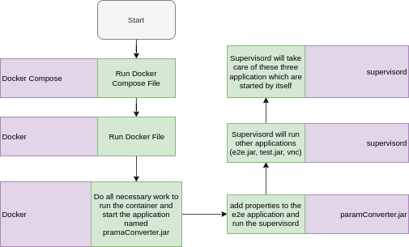

## Task Description
Have to run multiple process in a single container. It was  suggested to use consol/ubuntu-xfce-vnc ([CLICK HERE TO READ MORE](https://hub.docker.com/r/consol/ubuntu-xfce-vnc "VNC Docker Hub")) as base image.

## Approch
To complete the given task, I have used consol/ubuntu-xfce-vnc as a base image and three java applications in order to run these three applications in a single container. I have used supervisord to manage these applications([CLICK HERE TO READ MORE](http://supervisord.org/ "supervisord official documentation")). 
---
The basic idea is, I have created a docker file which is responsible to to run a single spring boot application (paramConverte.jar). This  application is responsible to add all the parameters that are required by two other applications and also responsile to run the supervisord. When the supervisord will run, It will run other two applications named e2e.jar, test.jar, vnc and also take care of these applications. I am giving a flow chart, so that you can get a pictural view what I have done.
---

## Flow Char Of WorkFlow


## Description of Docker Compose File
Docker Compose file contains the following lines of code.

```bash
version: "3.0"

services:
  e2e:
    image: e2e:latest
    build: ./
    ports: 
      - "6901:6901"
      - "5901:5901"

````
---
Here service name is 2e2 and image name is e2e:latest. I have mapped 6901 and 5901 ports of my local machile to 6901 and 5901 ports respectively of the container. This compose file will run the docker file which will run paramConverter.jar.
---

## Description of Docker File
Docker file contains the following lines of code.

```bash
FROM consol/ubuntu-xfce-vnc

USER root

RUN apt-get update && apt-get install -y supervisor

ENV JAVA_VERSION 8
ENV JAVA_HOME /usr/lib/jvm/jdk1.8.0_211
ENV JRE_HOME /usr/lib/jvm/jdk1.8.0_211/jre/

RUN mkdir -p /usr/lib/jvm
RUN mkdir -p /usr/local/e2e
RUN mkdir -p /usr/local/test
RUN mkdir -p /usr/local/commandConverter

ADD ./jdk1.8.0_211.tar.gz /usr/lib/jvm/

RUN ln -s "$JAVA_HOME/bin/"* "/usr/bin/"

RUN echo "export JAVA_HOME=/usr/lib/jvm/jdk1.8.0_211" >> ~/.bashrc 

ADD ./e2e.tar.gz /usr/local/
COPY ./app.properties /usr/local/e2e/app.properties
COPY ./e2e-start.sh /usr/bin/e2e-start.sh
RUN chmod +x /usr/bin/e2e-start.sh
COPY ./supervisord.conf /usr/bin/supervisord.conf
RUN chmod +x /usr/bin/supervisord.conf

COPY ./test.jar /usr/local/test
COPY ./test-start.sh /usr/bin/test-start.sh
RUN chmod +x /usr/bin/test-start.sh

COPY ./paramConverter.jar /usr/local/commandConverter
RUN chmod +x /usr/local/commandConverter

EXPOSE 5901
EXPOSE 6901


ENTRYPOINT ["java", "-jar", "/usr/local/commandConverter/paramConverter.jar"]

CMD ["-c", "/usr/local/e2e/app.properties"]

````
Now I will discus each and every line of this file.

```bash
FROM consol/ubuntu-xfce-vnc
```
The above line will download the base image of vnc from docker hub if local machine does not contain.

```bash
USER root
```
The above line define the user of the machine.

```bash
ENV JAVA_VERSION 8
ENV JAVA_HOME /usr/lib/jvm/jdk1.8.0_211
ENV JRE_HOME /usr/lib/jvm/jdk1.8.0_211/jre/
```
Above group of commands will set the environment variable for SDK.

```bash
RUN mkdir -p /usr/lib/jvm
RUN mkdir -p /usr/local/e2e
RUN mkdir -p /usr/local/test
RUN mkdir -p /usr/local/commandConverter
````
With the help of above commands I am creating directory so that I can put necessary files there.

```bash
ADD ./jdk1.8.0_211.tar.gz /usr/lib/jvm/
````
Here I am copying the JDK to jvm folder of the image.

```bash
RUN ln -s "$JAVA_HOME/bin/"* "/usr/bin/"
```
Here I am setting the JDK as a home variable.

```bash
RUN echo "export JAVA_HOME=/usr/lib/jvm/jdk1.8.0_211" >> ~/.bashrc 
````
By running the above command, I am exporting the JAVA_HOME so that system can use this JDK.

```bash
ADD ./e2e.tar.gz /usr/local/
COPY ./test.jar /usr/local/test
COPY ./paramConverter.jar /usr/local/commandConverter
```
Here I am putting e2e, test, paramConverter jar file to their destination.

```bash
COPY ./e2e-start.sh /usr/bin/e2e-start.sh
COPY ./test-start.sh /usr/bin/test-start.sh
COPY ./supervisord.conf /usr/bin/supervisord.conf
COPY ./app.properties /usr/local/e2e/app.properties
```
Here I am copying the starter and config files which are used by the applications. Here __e2e-start.sh__ bash file is used to start e2e.jar application, __test-start.sh__ bash file is used to start test.jar application and __supervisord.conf__ and __app.properties__ is used by the supervisord and e2e application respectively.

```bash
RUN chmod +x /usr/bin/e2e-start.sh
RUN chmod +x /usr/bin/supervisord.conf
RUN chmod +x /usr/bin/test-start.sh
RUN chmod +x /usr/local/commandConverter
```
Here I am providing permission to the files so that everyone can run them.

```bash
EXPOSE 5901
EXPOSE 6901
```
Above code snipet expose the ports.

```bash
ENTRYPOINT ["java", "-jar", "/usr/local/commandConverter/paramConverter.jar"]
```
This is the entry point by which paramConverter.jar file will be started.

```bash
CMD ["-c", "/usr/local/e2e/app.properties"]
```
Here I am sending property file location, which will be used by thee2e.jar application

## Description of Supervisord Config File

supervisord.config file contains the following code snippet.

```bash
[supervisord]
nodaemon=true

[program:e2e]
startsecs = 0
command = /usr/bin/e2e-start.sh
user = root
autostart = true
autorestart = false

[program:test]
startsecs = 0
command = /usr/bin/test-start.sh
user = root
autostart = true
autorestart = false

[program:vnc]
startsecs = 0
user=default
command = /dockerstartup/vnc_startup.sh
autostart = true
autorestart = true
```

Here I have configured which programes supervisord will run and how the program will run. Here __startsecs__ means watting time to run the program, __command__ defines which file should be run to start a perticular program, __user__ means user of the application. We are defining autostart and autorestart policy by __autostart= true__ and __autorestart = true__ respectively.

## Description of e2e-start.sh File
This file contains the following lines of code snippet.

```bash
#!/bin/bash

java -jar /usr/local/e2e/e2e.jar
```
Here I am running the e2e.jar file using command.

## Description of test-start.sh File
This file contains the following lines of code snippet.

```bash
#!/bin/bash

java -jar /usr/local/test/test.jar
```
Here I have disi the same thing which is done in e2e-start.sh file.


## How to run this container

1. Open the project using vscode.
1. Open terminal of the vscode
1. Run __docker-compose build__ command to build the image.
1. Run __docker-compose up__ command to start the container.
1. Then go to your browser and write __127.0.0.1:6901__ and press enter.

Now your container is running. you can open the terminal and make a __htop__ command to verify whether the other applications are running or not. (If you don't have the htop, just run __apt-get inatall htop__ to install htop to your container).

## N.B.
To best of my knowledge, I have explained everything what I know about this task. There are some areas, where I have 0% knowledge. I will definitely clear those and also write another file. Special thanks to __Mehedi bhai__ and __Anwar bhai__. Without your this task can not be done by me. JDK file size is too large to fit in github. So I am giving google drive link, so that you can download this JDK and run the docker.
[CLICK HERE TO DOWNLOAD JDK](https://drive.google.com/open?id=1nr7-JNKSu0th_aQyvmFYuJqczMOOgIXM "Download JDK")
